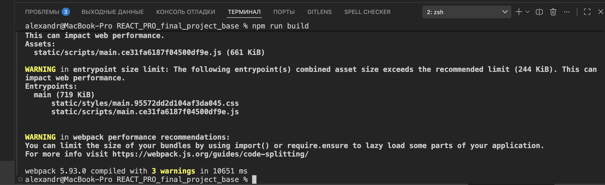
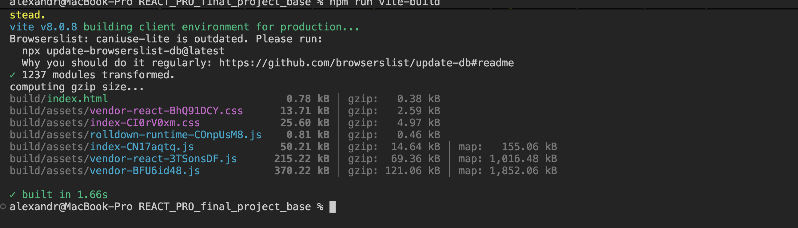

# 📦 React pro

## Что сделано

### 1. Архитектурная и структурная реорганизация по fsd методологии

### 2. Оптимизация рендеров ...

### 3. Создана модалка с React.Portal

### 4. В модалке используется useRef для установления фокуса

### 5. Применена сборка приложения с помощью vite

### 6. Применен хук из 19 версии реакта ...

## 2. Структура папок (пример по методологии FSD)

Проект организован согласно Feature-Sliced Design. Слои расположены по зависимости снизу вверх (`shared` → `entities` → `features` → `widgets` → `pages` → `app`).

## 3. Сравнение сборок

